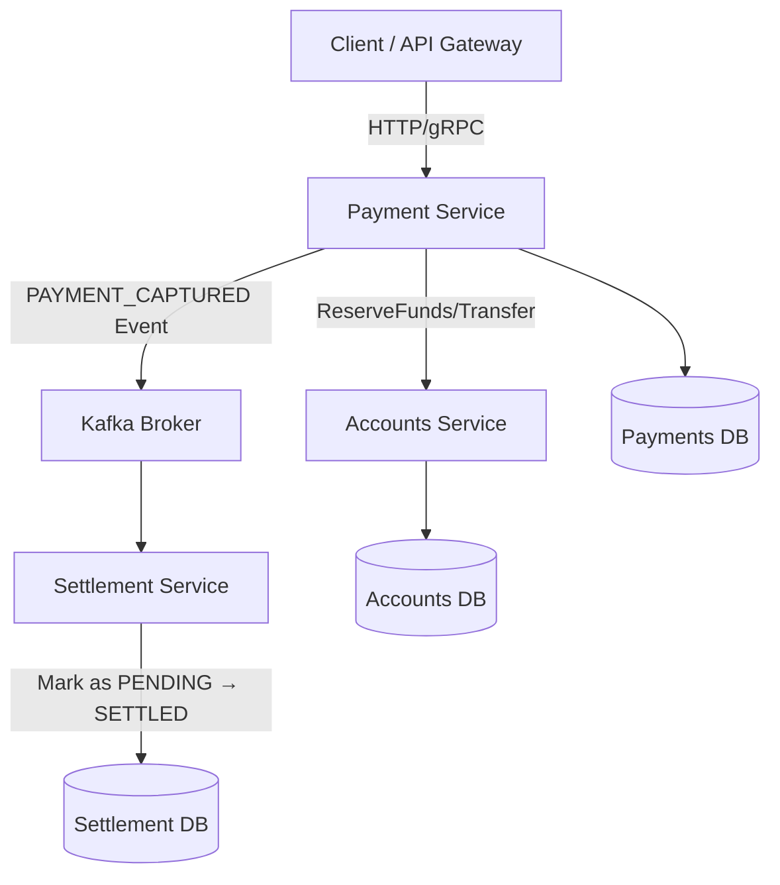
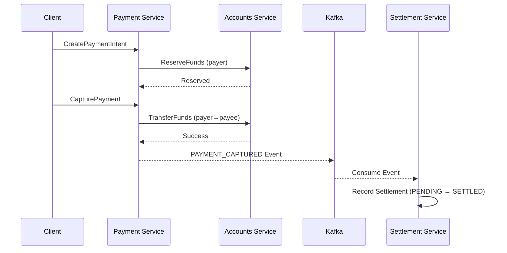

# Bank Settlement System

A **microservices-based financial transaction system** that simulates how real-world payment networks process, capture, and settle payments.

<br />

## Architecture Overview



<br />

## Services Overview

#### Accounts Service
Handles account creation, balance management, and fund reservations (**ReserveFunds** and **TransferFunds** operations).

#### Payment Service
Handles **CreatePaymentIntent** and **CapturePayment**, integrates with Accounts Service, and emits Kafka events for settlements.

#### Settlement Service
Consumes `PAYMENT_CAPTURED` events, marks settlements as `PENDING` → `SETTLED`.

<br />

## Payment Flow



<br />

## Key Non-Functional Features
- Built with **Golang**
- **gRPC** used for inter-service communication.
- **Outbox Pattern**–based event-driven communication over **Kafka**, enabling guaranteed asynchronous updates.
- **Idempotency** keys ensure repeat requests (like retries) do not duplicate transactions.
- Compatible with container orchestration (**Dockerized** microservices).

<br />

## Setup Instructions

```bash
git clone https://github.com/parasagrawal71/bank-settlement-system.git
cd bank-settlement-system
./start.sh
# To stop the servers: ./stop.sh
```

<br />

## Folder Structure

```
bank-settlement-system/
│
├── services/
│   ├── accounts-service/
│   ├── payments-service/
│   └── settlement-service/
│
├── infra/
│   ├── kafka/
│   └── postgres/
│
└── shared/
    └── db/
```
